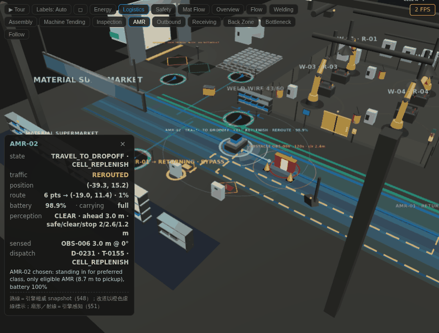

# RFTwin · Robot Factory Digital Twin

**A browser-native digital twin of a robotic production line — backend-authoritative, deterministic, explainable.**
Four process cells, 12 robot arms and an AMR fleet run in a Python simulation engine; the 3D factory in the browser only
renders. Same seed, same result — so every KPI, dispatch and detour can be traced to its cause.

A manufacturing-focused sibling to [WareTwin](https://github.com/WayneChou-bot/WareTwin), extending the same
deterministic and explainable twin principles from warehouse operations to robotic production.



[](https://github.com/WayneChou-bot/RFTwin/actions/workflows/ci.yml)
[](https://rf-twin.vercel.app/)
[](LICENSE)
 
  

## What it does

| Capability | See it |
|---|---|
| **Deterministic simulation** — same seed, same result | Every run starts from the identical pre-rolled 10:00 state (same `seq`, KPIs, AMR positions); the engine's state hash is asserted by `tests/test_engine.py`, and what-if branches replay bit-identically |
| **Fault propagation** — inject a jam and watch blocking/starvation travel down the line | Inject → C-03 jam: Machine Tending BLOCKED and Inspection STARVED within ~50 s, recovery < 10 s after repair |
| **What-if branches** — isolated engines, baseline vs scenario | 12-metric Δ/Δ% table, first divergence event, "Apply to LIVE"; live state hash unchanged |
| **AMR traffic** — detection, yielding, timed reroute, spatial obstacles | Select an AMR: ±45° perception fan and rays; drop an obstacle → `AMR_DETOUR`, dashed bypass corridor |
| **Explainable dispatch** — every assignment records candidates and why they lost | Audit → Dispatch Decisions; `DEFERRED` explains why no vehicle was eligible |
| **Energy accounting** — per-asset power, demand limit, saving opportunities with evidence | Energy view and 3D heatmap |
| **Inspection ground truth vs verdict** — synthetic parts, ONNX model, escapes and false rejects tracked | Select R-11/R-12: camera feed, verdict vs truth |
| **Honest connectivity** — LIVE → RECONNECTING → STALE → LOCAL DEMO | Kill the backend: STALE after 15 s, then a 5-minute deterministic replay (not a second engine) |
| **Bilingual UI** — English / 繁體中文 | Header toggle (中 / EN); defaults to the browser language and is remembered. Engine output (events, dispatch reasons) stays English by design |

**Try it:** [rf-twin.vercel.app](https://rf-twin.vercel.app/) — the header badge reads **LIVE** once the backend
(a free Hugging Face Space) is awake; if it has gone to sleep the page shows **LOCAL DEMO** (deterministic replay)
and offers to switch to Live when the engine is back, typically within a minute.

## Quick start

```bash
pip install -r requirements.txt
npm ci && npm --prefix frontend ci
npm run dev:all              # FastAPI (--reload) + Vite → http://localhost:5173
```

The header badge should read **LIVE**. If it reads **LOCAL DEMO** the backend did not start — on Windows port 8000 is
often reserved (`WinError 10013`); `dev:all` picks the next free port automatically. Walkthrough script and 30-second
pitch: [`docs/DEMO.md`](docs/DEMO.md).

## Architecture

```
simulation_parameters.yaml + factory_layout.json  →  FactoryEngine (Python, 100 ms tick, dump/load incl. RNG)
        Pydantic models → JSON Schema → TypeScript types (one-way, drift fails CI)
FastAPI: REST (inject / what-if / copilot / audit) + WebSocket (snapshot 1 Hz · events · amr_patch 10 Hz · control)
Vite + React + React Three Fiber: 3D factory, panels, Local Demo replay
```

Decisions are recorded as ADRs (backend-authoritative twin, one-way schema pipeline, sequenced events, isolated what-if,
parameter provenance). Details: [`docs/ARCHITECTURE.md`](docs/ARCHITECTURE.md).

## Tests & CI

`npm run ci` regenerates schemas, fixture and types and runs **157 pytest** cases; Playwright covers **13 e2e** cases
(viewport, Reset, detour, perception/dispatch, language switch, cross-tab sync, live Reset). The GitHub Actions workflow runs the same
pipeline plus a live-backend e2e stage (`.github/workflows/ci.yml`). See [`docs/TESTING.md`](docs/TESTING.md).

## Stack

Python 3.11 · Pydantic · FastAPI · WebSocket (wsproto) · React 18 · TypeScript · Vite · React Three Fiber · Zustand ·
onnxruntime · Playwright · pytest. Single-container deployment with a rate-limit/origin/body guard:
[`docs/DEPLOY.md`](docs/DEPLOY.md).

## Honest limits

- All numbers are simulation assumptions, not real factory standards.
- Vision inspection uses synthetic 64×64 parts and a demo-grade ONNX model — it is an operational model of inspection,
  not an industrial inspection system.
- Local Demo is a pre-generated replay; after a disconnect it restarts from the replay origin rather than continuing the
  live state.
- The GIF above is a software-rendered headless capture (2–6 FPS); on a desktop GPU the view runs at 60 FPS.

## Acknowledgement

Inspired by the deterministic simulation and explainable operations patterns developed for
[WareTwin](https://github.com/WayneChou-bot/WareTwin) (same author). The two projects share design principles, not a
runtime package.

## License

MIT © 2026 Wayne Chou — see [LICENSE](LICENSE).

---

<details>
<summary>中文摘要</summary>

RFTwin 是一條四製程、12 台機械手臂、2 台 AMR 的機器人工廠數位分身，是 WareTwin（倉儲）的製造業姊妹專案，延續同一套確定性、可解釋的分身原則。Python 引擎是唯一的事實來源，瀏覽器只呈現；同 seed
同結果，所以每個 KPI、每次派工、每次改道都能追到原因。能做的事：故障傳播、隔離引擎 What-if（12 項指標＋第一分歧＋
套用到 Live）、AMR 偵測／讓行／改道與感知視覺化、可解釋派工紀錄、能源帳、檢測真值 vs 判定、誠實的連線狀態
（斷線後回放而不是假裝連線）。介面可切換英文／繁體中文（Header 的 中／EN，預設跟瀏覽器語言）。`npm run dev:all` 啟動；操作腳本見 `docs/DEMO.md`，架構與開發指南見
`docs/ARCHITECTURE.md`，測試見 `docs/TESTING.md`。

</details>
